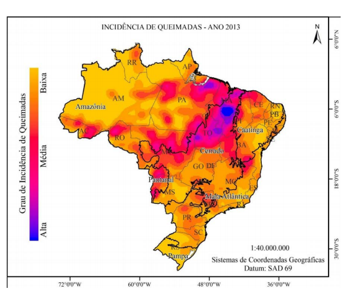
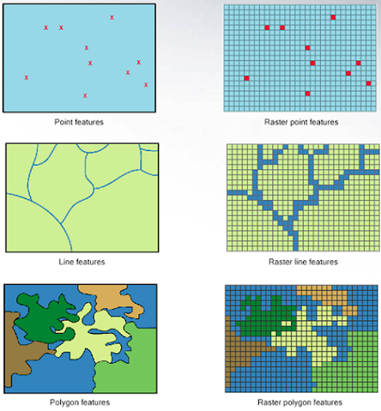

```{r setup, include=FALSE}
options(htmltools.dir.version = FALSE)
```

class: inverse, center, middle

# ANÁLISE ESPACIAL

---
## Operações acessórias à geocodificação

+ Edição de feições - complemento `NumericalDigitize`
+ Adicionar camada de pontos com coordenadas
+ Adicionar basemap
+ Adicionar coordenadas a um `shapefile` 

---
# O que representar
### Entidades realmente existentes (visíveis); Exemplos: edificações, ruas.

### Conceitos abstratos (invisíveis): exclusão/inclusão social, violência, pobreza/riqueza, desigualdade

#### Inclui transformações, manipulações e métodos que podem ser aplicados aos dados geográficos para adicionar valor a eles, apoiar decisões e revelar padrões e anomalias que não são óbvios à primeira vista. 

#### Tomada de decisão

---
# Visualização de fenômenos sociais no espaço

### Mapas coropléticos

```{r echo=FALSE, out.width='50%', fig.align = 'center'}
knitr::include_graphics('./img/coropl.png')
```

---
# Visualização de fenômenos sociais no espaço

### Mapas de pontos

```{r echo=FALSE, out.width='50%', fig.align = 'center'}
knitr::include_graphics('./img/pontos.png')
```

---
# Visualização de fenômenos sociais no espaço

### Representação de fluxos
```{r echo=FALSE, out.width='50%', fig.align = 'center'}
knitr::include_graphics('./img/fluxos.png')
```
---

# Visualização de fenômenos sociais no espaço

### Mapas de calor

```{r echo=FALSE, out.width='60%', fig.align = 'center'}

```

---

# Visualização de fenômenos sociais no espaço

### Cartogramas
```{r echo=FALSE, out.width='50%', fig.align = 'center'}
knitr::include_graphics('./img/1_cartograma.png')
```

---
# Visualização de fenômenos sociais no espaço

### Símbolos proporcionais

```{r echo=FALSE, out.width='55%', fig.align = 'center'}

```

---

# Operações geográficas com dados vetoriais

### Agregação (Dissolve)
+ Elimina divisões indesejáveis considerando os valores de atributos.

```{r echo=FALSE, out.width='60%', fig.align = 'center'}
knitr::include_graphics('./img/1_agregacao.png')
```
---
# Operações geográficas com dados vetoriais

### União (Merge)
+ Combina layers diferentes

```{r echo=FALSE, out.width='55%', fig.align = 'center'}
knitr::include_graphics('./img/2_uniao.png')
```
---
# Operações geográficas com dados vetoriais

### Interseção (Intersect)
+ Interseção - atributos de todas as feições estarão no arquivo de saída considerando a sobreposição 

```{r echo=FALSE, out.width='55%', fig.align = 'center'}
knitr::include_graphics('./img/4_intersecao.png')
```
---
# Operações geográficas com dados vetoriais

### Recortar (clip)
+ Recortar - somente atributos das feições de entrada estarão no arquivo de saída

```{r echo=FALSE, out.width='55%', fig.align = 'center'}
knitr::include_graphics('./img/cortar_1.png')
```

---
# Operações geográficas com dados vetoriais

### Diferença
+ É o inverso da interseção

```{r echo=FALSE, out.width='60%', fig.align = 'center'}
knitr::include_graphics('./img/5_diferenca.png')
```
---
# Operações geográficas com dados vetoriais

### Atribuir dado por localização
```{r echo=FALSE, out.width='75%', fig.align = 'center'}

```

---
# Operações geográficas com dados vetoriais

### Junção relacional
+ Junção relacional: combina o conteúdo de duas tabelas usando uma chave comum - **NÃO É ESPACIAL!**

```{r echo=FALSE, out.width='55%', fig.align = 'center'}
knitr::include_graphics('./img/bd_relacional.png')
```
---
# Operações geográficas com dados vetoriais

### Junção espacial
+ Operação ponto em polígono: compara as propriedades dos pontos com as das áreas onde estão contidos.

+ Sobreposição de feições: permite determinar se duas áreas se sobrepõe, determinar a área de sobreposição e definir a área formada pela sobreposição.

```{r echo=FALSE, out.width='65%', fig.align = 'center'}

```

---

# Dados Matriciais

Operações de sobreposição são mais simples. Atributos de diferentes matrizes podem ser combinados por meio de álgebra de mapas. 

```{r echo=FALSE, out.width='55%', fig.align = 'center'}
knitr::include_graphics('./img/raster.png')
```

---
# Dados Matriciais

```{r echo=FALSE, out.width='55%', fig.align = 'center'}

```

---
# Dados Matriciais

```{r echo=FALSE, out.width='35%', fig.align = 'center'}
knitr::include_graphics('./img/Vector-Raster.png')
```


---
# Qual utilizar?

```{r echo=FALSE, out.width='90%', fig.align = 'center'}
knitr::include_graphics('./img/raster_vector.gif')
```


---
# Proximidade x similaridade

```{r echo=FALSE, out.width='70%', fig.align = 'center'}
knitr::include_graphics('./img/simi_prox.png')
```

---
# Padrões espaciais

.pull-left[
```{r echo=FALSE, out.width='100%', fig.align = 'center'}

```
]

.pull-right[
```{r echo=FALSE, out.width='100%', fig.align = 'center'}
knitr::include_graphics('./img/padroes_areas.png')
```
]

---

# Medidas centrográficas

```{r echo=FALSE, out.width='70%', fig.align = 'center'}

```
---

# Medidas centrográficas

### Centro Médio

.pull-left[
```{r echo=FALSE, out.width='100%', fig.align = 'center'}
knitr::include_graphics('./img/mc3.jpeg')
```
]

.pull-right[
```{r echo=FALSE, out.width='100%', fig.align = 'center'}

```
]

---
# Medidas centrográficas

### Distância Padrão

.pull-left[
```{r echo=FALSE, out.width='100%', fig.align = 'center'}

```
]

.pull-right[
```{r echo=FALSE, out.width='100%', fig.align = 'center'}

```
]


---
# Medidas centrográficas

### Aplicações

.pull-left[
```{r echo=FALSE, out.width='100%', fig.align = 'center'}
knitr::include_graphics('./img/india2.png')
```
]

.pull-right[
```{r echo=FALSE, out.width='100%', fig.align = 'center'}

```
]
---

# Medidas centrográficas

### Aplicações

.pull-left[
```{r echo=FALSE, out.width='100%', fig.align = 'center'}

```
]

.pull-right[
```{r echo=FALSE, out.width='100%', fig.align = 'center'}

```
]
---

# Medidas centrográficas no R
.pull-left[
```{r echo=TRUE, message=FALSE, warning=FALSE}
library(aspace)
library(sf)
library(tmap)
library(cluster)
library(geosphere)
library(sp)

data <- read_sf("D:/OneDrive - cefetmg.br/01_disciplinas/ERE/gis/02_pratica/dados_espaciais/ESCOLAS_PARTICULARES/ESCOLAS_PARTICULARES.shp")
bh <- read_sf("D:/OneDrive - cefetmg.br/01_disciplinas/ERE/gis/02_pratica/dados_espaciais/BAIRRO/BAIRRO.shp")

data_sp <- as_Spatial(data)
```
]

.pull-right[
```{r}
tm_shape(data) +
   tm_dots(size = 1.5, col = "grey40", alpha = 0.3) +
tm_shape(bh) +
   tm_borders(col = "grey40", lwd = 1, lty = "solid", alpha = 0.3)

#plot(data_sp)
```
]

---

# Plotar pontos a partir de coordenadas

```{r echo=TRUE, message=FALSE, warning=FALSE}
xy <- st_coordinates(data) # arquivo para calculos centrográficos

xy_coord <- as.data.frame(st_coordinates(data)) %>%
   st_as_sf(coords = c('X', 'Y'), crs = 31983) # conversão em sf para representação espacial de coordenadas como pontos
```

.center[
```{r echo=TRUE, message=FALSE, warning=FALSE, out.width = '300px'}
tm_shape(data) +
   tm_dots("ID_EQ_ED")
```
]
---
# Plotar pontos a partir de coordenadas

.pull-left[
```{r eval=TRUE, echo=TRUE, message=FALSE, warning=FALSE, results='hide'}
tm_shape(xy_coord) +
      tm_dots(col="red")
```
]

.pull-right[
```{r eval=TRUE, echo=TRUE, message=FALSE, warning=FALSE, results='hide'}
tm_shape(data) + 
   tm_bubbles("NUMERO", col="blue", alpha = 0.5) + # Considerando os números como número de alunos matriculados
tm_shape(bh) +
   tm_borders(col = "grey40", lwd = 1, lty = "solid", alpha = NA)
```
]

---
# Centro Médio e distância padrão
.pull-left[
```{r}
mc <- mean_centre(filename="mean_center.txt", weighted=FALSE, weights=NULL, points=xy)
```
]

.pull-right[
```{r}
mc_sd <- calc_sdd(filename="SDD_Output.txt", centre.xy=NULL, calccentre=TRUE, weighted=FALSE, weights=NULL, points=xy, verbose=FALSE) 
# usar xy - Retorna um dataframe com o centro médio e a distância padrão - raio.
```
]

---
# Centro Médio e distância padrão

[Documentação](https://rdrr.io/cran/aspace/man/plot_sdd.html)
.center[
```{r, out.width = '400px'}
plot_sdd(plotnew=TRUE, plothv=FALSE, plotweightedpts=FALSE, plotpoints=TRUE, plotcentre=TRUE, titletxt="Title", points.col = "gray", xaxis="Easting (m)", yaxis="Northing (m)", centre.col="black", centre.pch = 25)
```
]


---
# Centro Médio e Distância Padrão ponderados

```{r}
wtc <- function(g,w){
  if (!(is(g,"sf")) | !(w %in% colnames(g))){
    stop(paste("requires an sf object with at a column",w))
  }
  centers = st_coordinates(st_centroid(st_geometry(g)))
  # crsx = st_crs(g) how could i reuse the CRS of g? do i need that?
  out = st_point(c(weighted.mean(centers[,"X"],g[[w]]), weighted.mean(centers[,"Y"],g[[w]])))
  return(out)
}
```
---
# Centro Médio e Distância Padrão ponderados
.center[
```{r eval=TRUE, echo=TRUE, message=FALSE, warning=FALSE, results='hide'}
plot(st_geometry(data))
plot(st_centroid(st_union(data)),col="red",pch=3,add=TRUE, lwd=2)
plot(wtc(data,"NUMERO"),col="blue",pch=3,add=TRUE, lwd=2)
```
]
